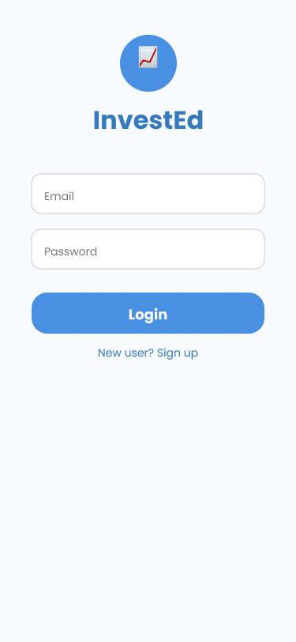
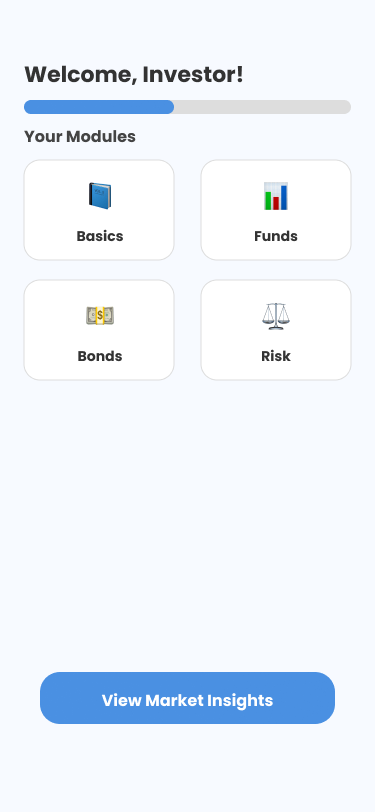
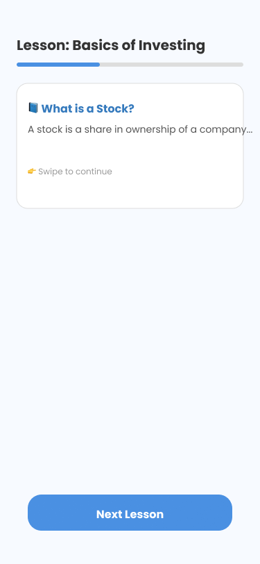
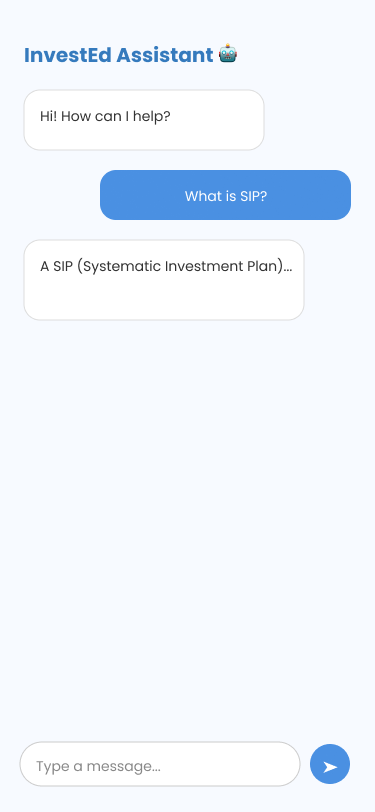

# InvestEd – Smart Learning & Engagement for Retail Investors 🎓💸
🎯 “Your personal guide to financial literacy – powered by AI + gamification.”

## 📌 Problem Statement
Retail investors often lack access to simplified financial knowledge and personalized guidance.  
Existing platforms are either too complex or not engaging enough, resulting in poor financial literacy and low investor participation.

## 🎯 Solution
**InvestEd** is an AI-powered interactive platform that enhances retail investor education and engagement.  
It delivers bite-sized learning, gamified experiences, and personalized recommendations to empower investors with knowledge and confidence.

## ✨ Key Features
- 📘 **Interactive Learning Modules** – simplified concepts on stocks, mutual funds, and bonds.  
- 🏆 **Gamification** – quizzes, rewards, and leaderboards to make learning fun.  
- 🤖 **AI Chatbot** – 24/7 support to answer investment-related questions in simple terms.  
- 🎯 **Personalized Learning Paths** – adaptive content based on user progress.  
- 👥 **Community Forums** – peer discussions and knowledge sharing.  
- 📊 **Progress Dashboard** – track learning milestones and engagement scores.  

## 🛠️ Technology Stack
- **Frontend:** React.js / Next.js  
- **Backend:** Node.js, Express  
- **Database:** MongoDB / PostgreSQL  
- **AI/ML:** NLP for chatbot, recommendation engine  
- **Cloud Hosting:** AWS / Azure  

## 🚀 Prototype Stage
Currently at **Wireframe / Mock-up** stage.  
MVP will include interactive modules, chatbot prototype, and gamified quiz system.

## 💡 Innovation / Differentiator
- AI-driven personalized financial education.  
- Gamification + Community engagement to sustain learning.  
- Simplifies complex financial jargon into everyday language.  

## 📈 Potential Impact
By making investor education **interactive, personalized, and accessible**, InvestEd empowers retail investors to make smarter financial decisions, increasing financial literacy and market participation.

---

## 🖼 Wireframe Preview
Here are the mock-ups created in Figma:

  
  
  
  

---

✨ Built with ❤️ in Figma + inspired by the mission of **financial literacy for everyone**.
